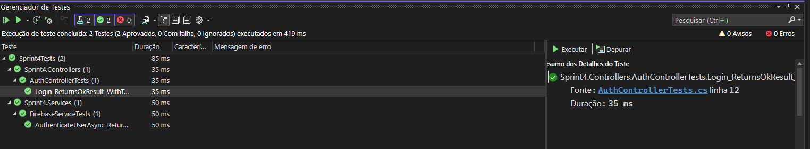
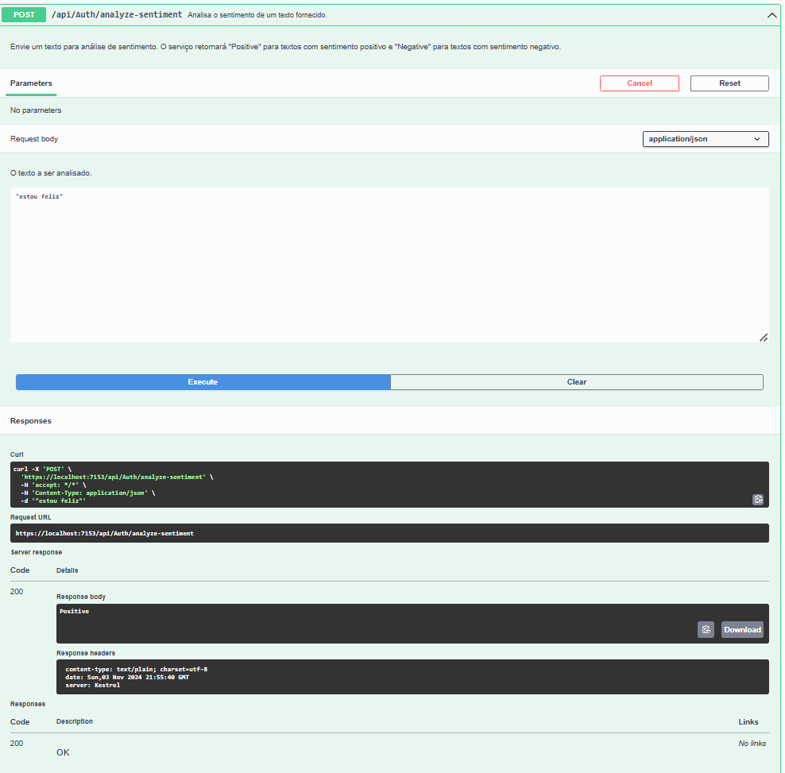

# SPRINT 4 : Advanced Business Development With .NET

# Integrantes

- Diogo Dias Rodrigues Gallina - RM98605 – 2TDSS
- João Dubas Leal Kleye Souza - RM76153 – 2TDSS
- Pedro Henrique Couto Archilha - RM550450 – 2TDSS
- Pedro Henrique Lourenço Rodrigues - RM98402 – 2TDSS
- Rafael Klanfer Nunes - RM99791 – 2TDSA

# Link para o repositório no GitHub

https://github.com/rafaelknunes/sprint-4

-----

# **Estrutura do Projeto**

- Sprint4: É a solução principal do projeto, contendo o projeto de API e a integração com o serviço do firebase. Também contém a análise de sentimento com ML.NET.
- Sprint4Tests: É o projeto de testes unitários, contendo os testes para as classes principais do projeto Sprint4.

-----

# **Roteiro de Implementação do Projeto**

# **Requisito 1 : Implementar a integração com um serviço externo utilizando uma API REST.**

Aqui vamos integrar com uma API de autenticação de terceiros (simulando um serviço como o Google ou GitHub).

- Criar um Projeto de API .NET usando ASP.NET Core Web API e a versão do .NET 8.0. Nossa solução chama-se `Sprint4`.
- Criar um serviço que usará o HttpClient para se comunicar com o Firebase. Esse serviço será utilizado para autenticar usuários.
    - `IMPORTANTE`: Para testar o endpoint `POST /api/auth/login`, use o usuário: `teste@teste.com` e senha: `123456`.
- Implementar o Endpoint para Chamar a API Externa.
- Lidar com a Resposta da API Externa

---

# **Requisito 2 : Implementar testes unitários utilizando o xUnit.**



### Detalhes sobre a implementação dos testes unitários:

Aqui vamos configurar testes unitários e de integração para validar o funcionamento do FirebaseService e do AuthController. Para isso, vamos utilizar o xUnit para criar e rodar os testes, e o Moq para simular dependências onde necessário.

Para rodar os testes, basta ir no menu Teste -> Rodar Todos os Testes. Ou verificar no Gerenciador de Testes.

Os testes unitários foram implementados para validar a funcionalidade e a integração entre os componentes FirebaseService e AuthController. Para isso, utilizamos o framework de testes xUnit e a biblioteca Moq para criar simulações (mocks) das dependências, permitindo que os testes sejam realizados de forma isolada, sem dependências externas.

### Passo 1. Estrutura do Projeto de Testes

Criamos o projeto Sprint4Tests como um projeto de teste separado, com o framework de destino .NET 8.0. Esse projeto inclui os testes para as classes principais do projeto Sprint4. No Sprint4Tests, temos os seguintes arquivos de teste:

- FirebaseServiceTests.cs: Para testar o comportamento do FirebaseService.
- AuthControllerTests.cs: Para validar o funcionamento do AuthController e sua interação com o FirebaseService.

### Passo 2. Ferramentas e Bibliotecas Utilizadas

- xUnit: Framework de testes utilizado para escrever e executar os testes unitários.
- Moq: Biblioteca de mocking usada para simular as dependências dos serviços, especialmente útil para o FirebaseService, que depende do HttpClient.

### Passo 3. Implementação dos Testes no FirebaseService

No arquivo FirebaseServiceTests.cs, foi testado o método AuthenticateUserAsync, que é responsável por autenticar o usuário. Como o FirebaseService depende do HttpClient para fazer chamadas externas, o Moq foi utilizado para simular o comportamento do HttpClient e fornecer uma resposta simulada.

### Passo 4. Implementação dos Testes no AuthController

No AuthControllerTests.cs, testamos o controlador de autenticação (AuthController). Para garantir a testabilidade e facilitar o mock, criamos uma interface (IFirebaseService) que é implementada pelo FirebaseService. Com isso, o AuthController depende de IFirebaseService, permitindo que o Moq simule o comportamento desse serviço.

### Passo 5. Vantagens da Abordagem Utilizada

- Isolamento: Ao usar interfaces e mocks, os testes são independentes de chamadas externas e podem ser executados rapidamente.
- Modularidade: O uso de IFirebaseService para abstrair FirebaseService permite substituir a implementação facilmente, promovendo a aplicação dos princípios SOLID.
- Manutenção: Essa abordagem facilita a atualização do código, pois os testes permanecem focados em comportamentos específicos.

---

# **Requisito 3 : Aplicar práticas de Clean Code, Solid.**

### Explicação sobre práticas do CLEAN CODE e SOLID:

- Clean Code: Código limpo é aquele que é fácil de entender e fácil de mudar. Ele deve ser legível e fácil de manter.

- SOLID: É um acrônimo que representa cinco princípios da programação orientada a objetos e design de código. São eles:

  - **S** - Single Responsibility Principle (Princípio da Responsabilidade Única)
  - **O** - Open/Closed Principle (Princípio do Aberto/Fechado)
  - **L** - Liskov Substitution Principle (Princípio da Substituição de Liskov)
  - **I** - Interface Segregation Principle (Princípio da Segregação de Interfaces)
  - **D** - Dependency Inversion Principle (Princípio da Inversão de Dependências)

### Aplicação dos Princípios do CLEAN CODE e SOLID no nosso projeto:

#### 1. **Single Responsibility Principle (SRP)**

O **SRP** afirma que cada classe deve ter apenas uma responsabilidade. aqui garantimos que:

- **FirebaseService**: Responsável apenas por gerenciar a comunicação com o Firebase.
- **AuthController**: Responsável apenas pela autenticação, delegando a lógica de autenticação ao `FirebaseService`.

#### 2. **Open/Closed Principle (OCP)**

O **OCP** sugere que classes devem ser abertas para extensão, mas fechadas para modificação. Isso pode ser feito com abstrações e injeção de dependências.

- O uso de `IFirebaseService` no `AuthController` já é um passo nessa direção, pois permite a extensão do comportamento de autenticação (como mudar para um serviço diferente) sem alterar o `AuthController`.

#### 3. **Interface Segregation Principle (ISP)**

O **ISP** afirma que classes não devem ser forçadas a depender de métodos que não utilizam. Em nosso caso, `IFirebaseService` foi projetada com apenas um método (`AuthenticateUserAsync`), então não há métodos desnecessários.

### Práticas de Clean Code

1. **Nomeação Clara e Coerente**:
   - Os nomes dos métodos e variáveis devem ser autoexplicativos. `AuthenticateUserAsync` é um bom exemplo de nome claro.

2. **Organização das Classes e Pastas**:
   - Organizamos as classes em pastas apropriadas (`Controllers`, `Services`, `Interfaces`)

3. **Comentários e Documentação XML**:
   - Nosso projeto inclui comentários e documentação XML no Swagger para facilitar a compreensão e teste do código.

4. **Métodos e Funções de Tamanho Reduzido**:
   - Nossos métodos tem um tamanho e uma complexidade gerenciáveis. Métodos pequenos, focados em uma única tarefa, são mais fáceis de manter e entender.

---

# **Requisito 4 : Integrar ML.NET na API, criar modelos simples e implementar funcionalidades de IA generativa que agregue valor à API.**

### Roteiro

- Configurar ML.NET e Dados para Treinamento.
- Treinar e Avaliar o Modelo de Análise de Sentimento.
- Salvar e Carregar o Modelo para Uso na API.
- Integrar o Modelo à API com um Endpoint para Análise de Sentimento.

### Exemplo de uso: Análise de sentimento da frase: "estou feliz"



### Funcionalidades de IA generativa adicionadas

Este projeto utiliza o **ML.NET** para implementar uma funcionalidade de IA generativa focada em **análise de sentimento**. Essa funcionalidade permite que o sistema identifique se o sentimento de um texto fornecido é positivo ou negativo.

#### Como Funciona

- **Treinamento do Modelo**: 
  - Um modelo foi treinado usando o ML.NET com um conjunto de dados de exemplo que contém frases e suas respectivas classificações de sentimento (positiva ou negativa).
  - O pipeline de treinamento inclui a vetorização do texto para transformá-lo em recursos numéricos, seguidos de um classificador baseado em regressão logística.
  - O modelo resultante é salvo como um arquivo (`sentiment_model.zip`) que pode ser carregado e usado pela API.

- **Predição de Sentimento**:
  - O modelo de sentimento é carregado pelo `SentimentAnalysisService`, que disponibiliza a funcionalidade de análise de sentimento.
  - A API oferece um endpoint `/analyze-sentiment` que recebe uma frase e retorna uma avaliação de sentimento:
    - **Positive** para uma frase com sentimento positivo.
    - **Negative** para uma frase com sentimento negativo.

#### Endpoint de Análise de Sentimento

O endpoint de análise de sentimento está disponível em:

```
POST /api/auth/analyze-sentiment
```

**Parâmetros**:
- **text** (string): A frase ou comentário para o qual deseja-se realizar a análise de sentimento.

**Exemplo de Requisição**:

```json
POST /api/auth/analyze-sentiment
Content-Type: application/json

{
    "text": "Estou feliz."
}
```

**Resposta**:
- `"Positive"` ou `"Negative"` conforme o sentimento detectado.

